# Class Diagram Examples

## Basic class

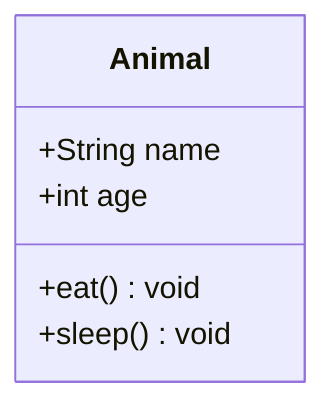

## Visibility markers

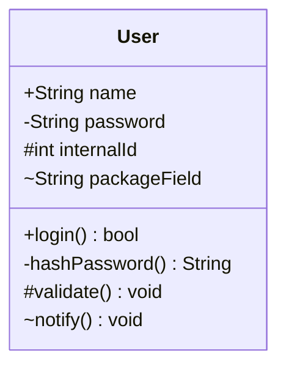

## Interface annotation

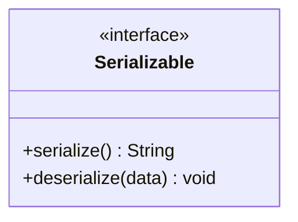

## Abstract annotation

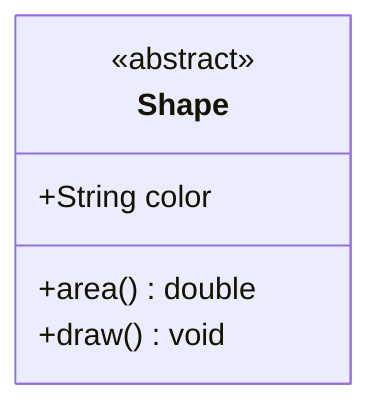

## Enum annotation

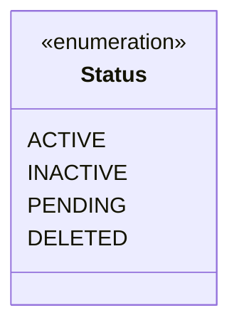

## Inheritance

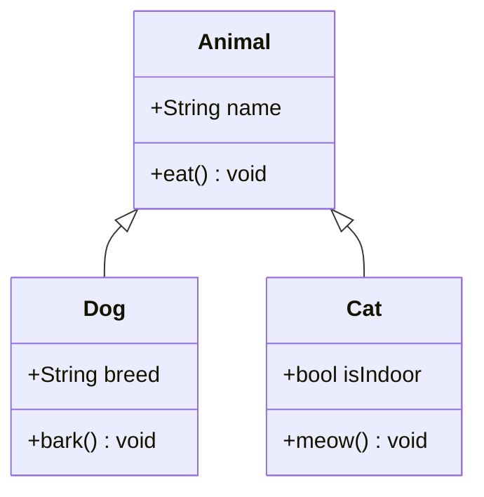

## Composition

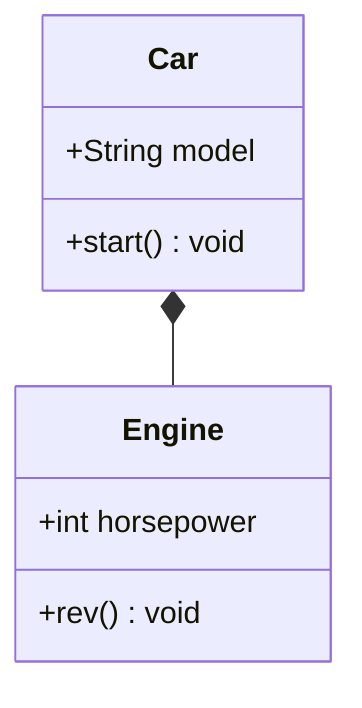

## Aggregation

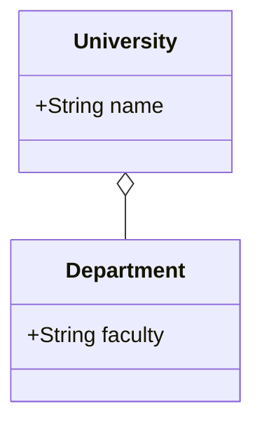

## Association

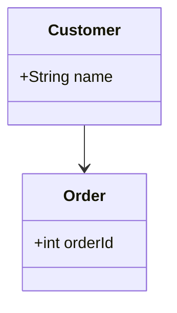

## Dependency

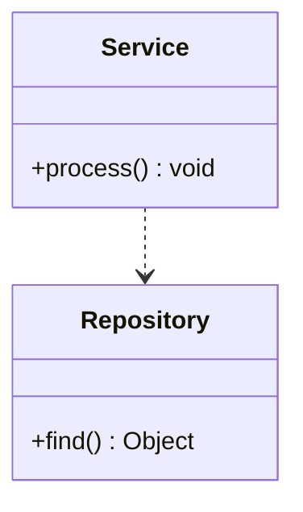

## Realization

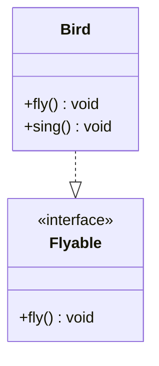

## All 6 relationship types

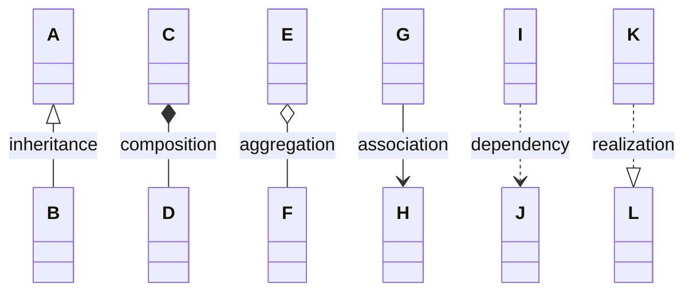

## Relationship labels

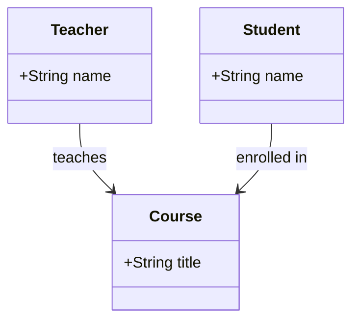

## Observer pattern

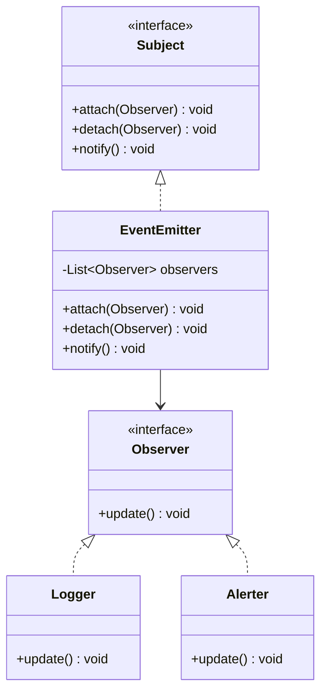

## MVC architecture

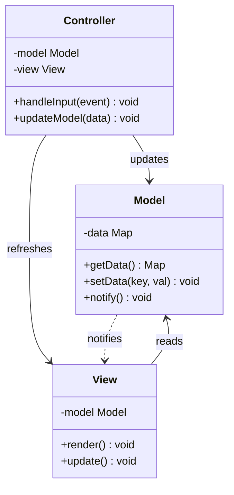

## Full hierarchy

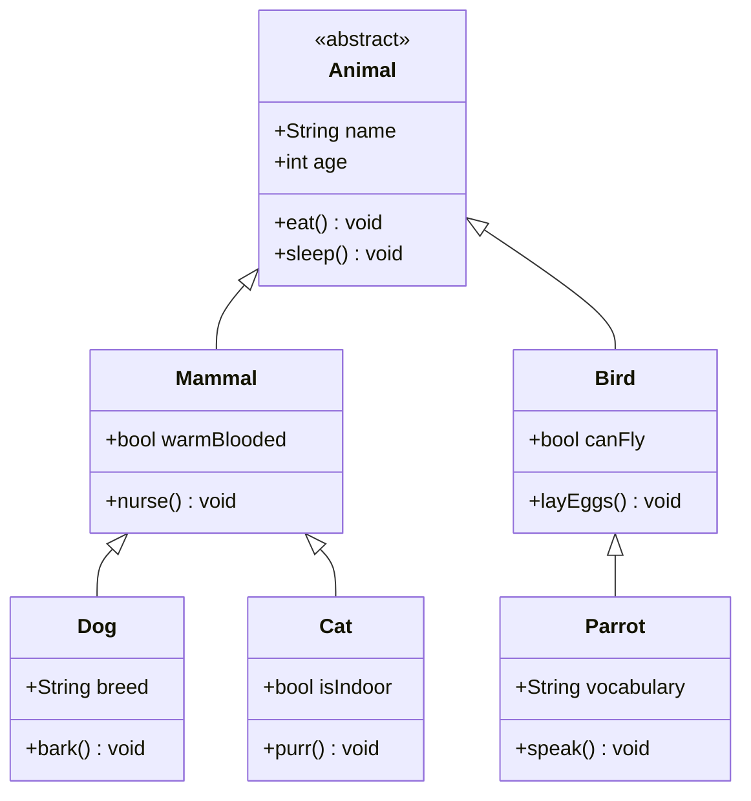
