# ER Diagram Examples

## Basic relationship

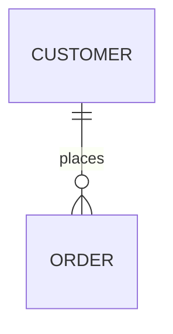

## Entity with attributes

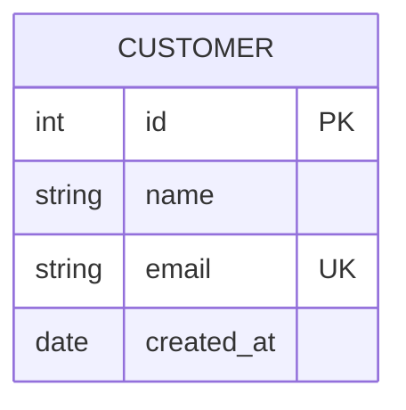

## Attribute keys (PK, FK, UK)

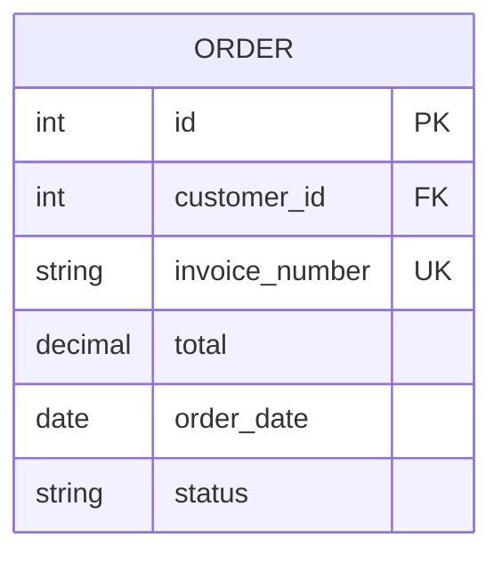

## Exactly One to Exactly One

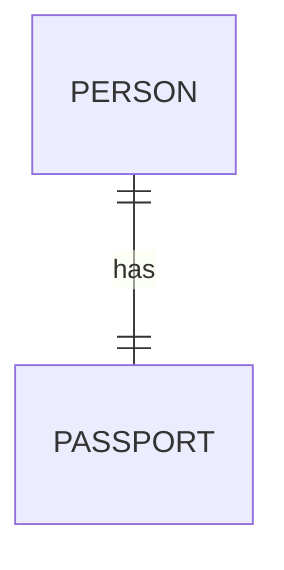

## Exactly One to Zero-or-Many

## Zero-or-One to One-or-Many

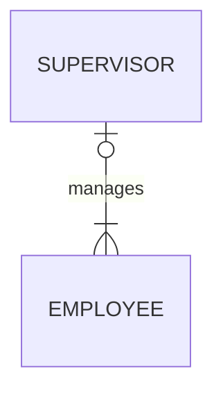

## One-or-More to Zero-or-Many

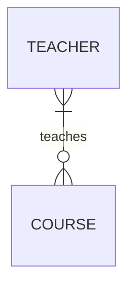

## All cardinality types

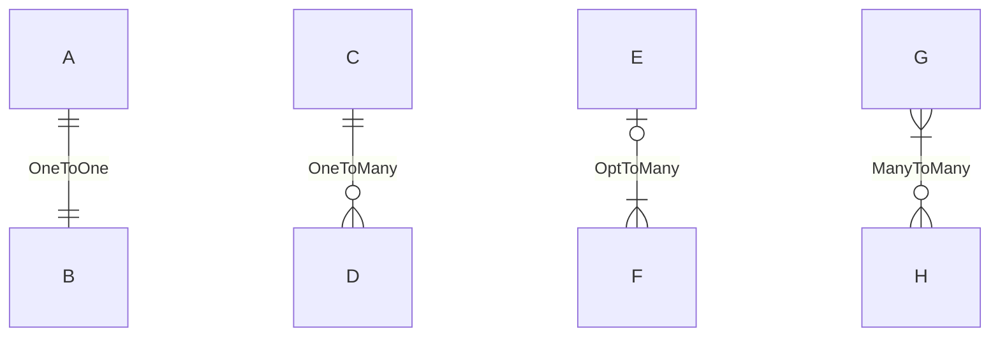

## Identifying relationship

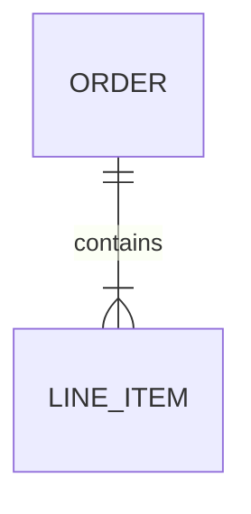

## Non-identifying relationship

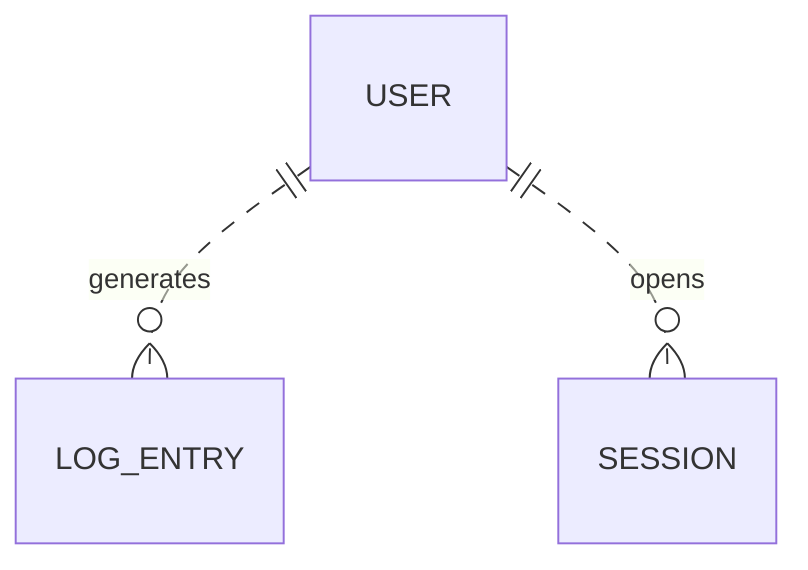

## Mixed identifying & non-identifying

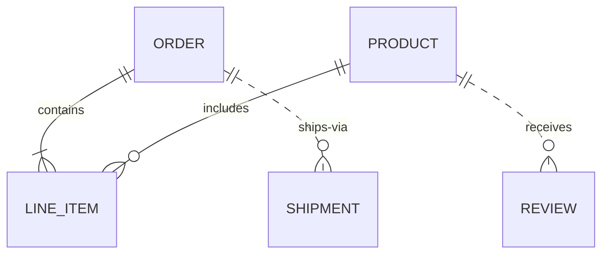

## E-commerce schema

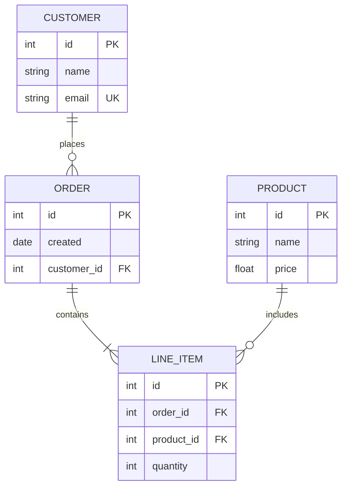

## Blog platform schema

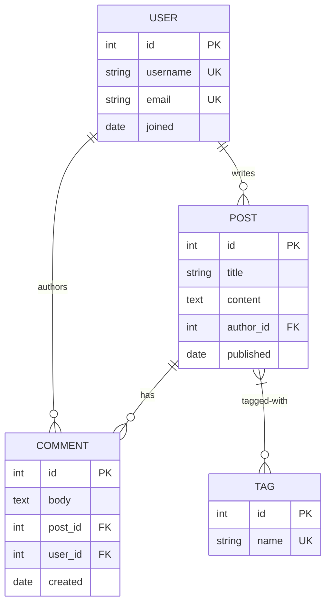

## School management schema

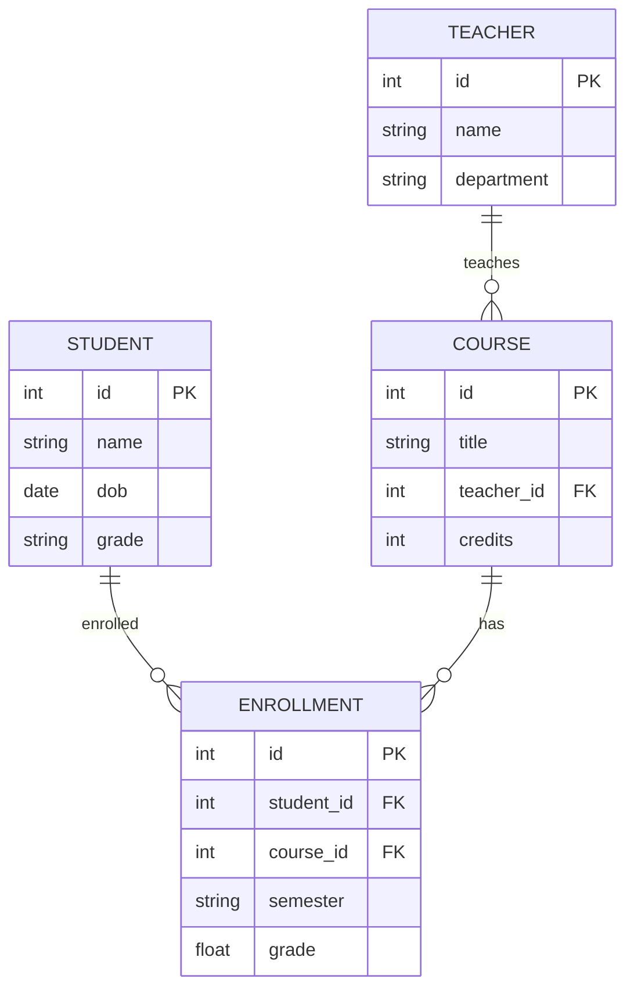
