# Flowchart Examples

## Basic linear flow

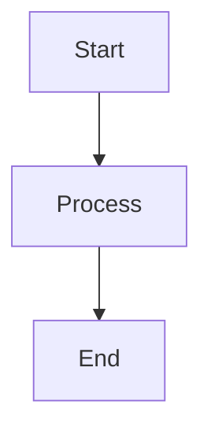

## All 12 shapes

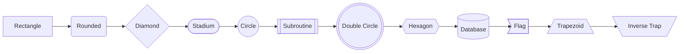

## All edge styles

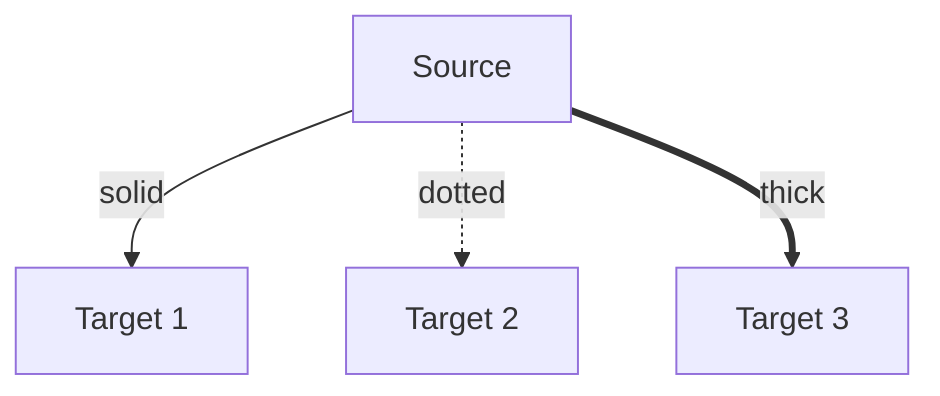

## No-arrow edges

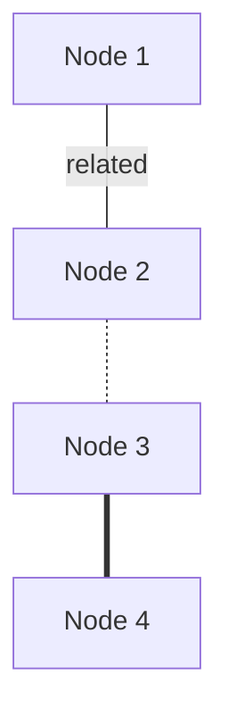

## Bidirectional arrows

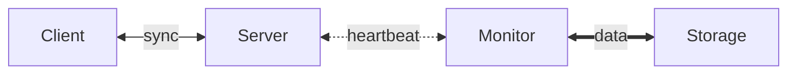

## Parallel links

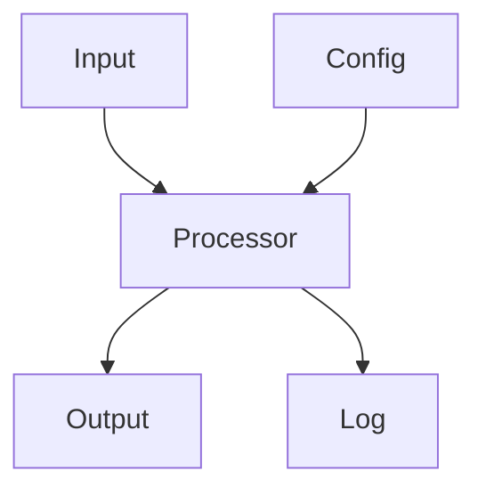

## Chained edges

## Direction: LR

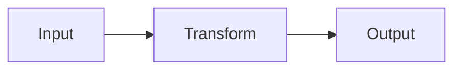

## Direction: BT

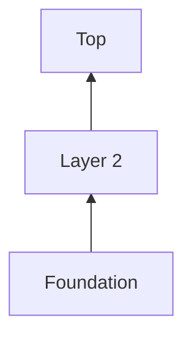

## Subgraphs

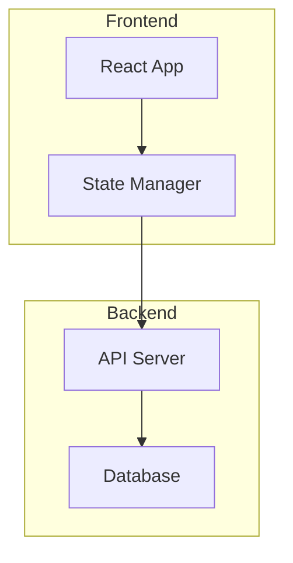

## Nested subgraphs

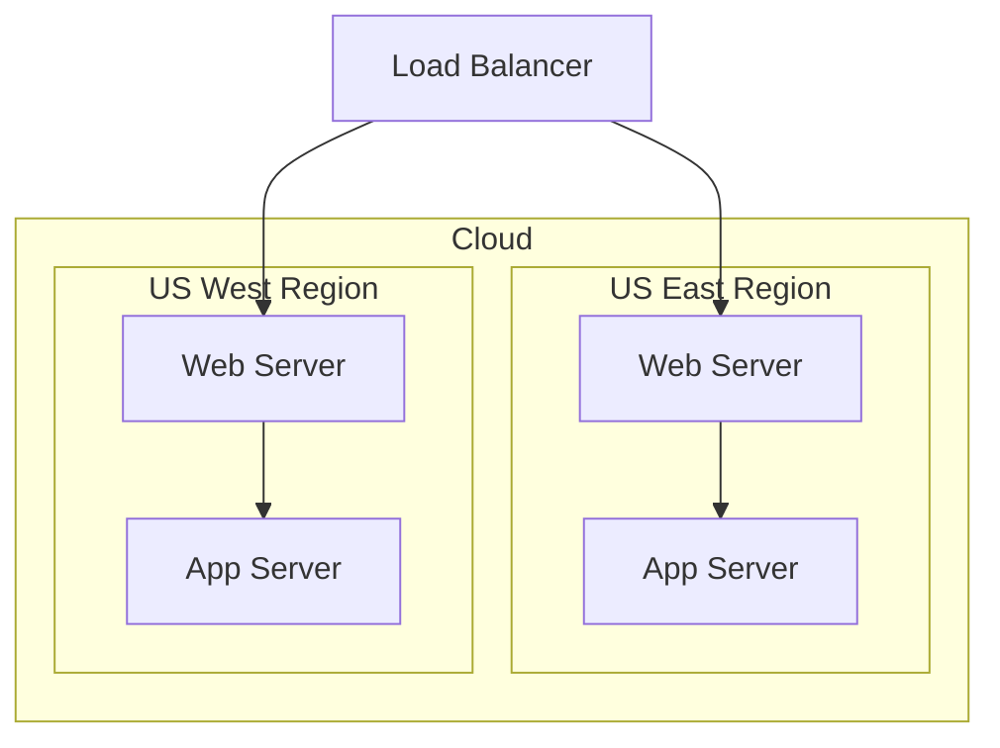

## Subgraph direction override

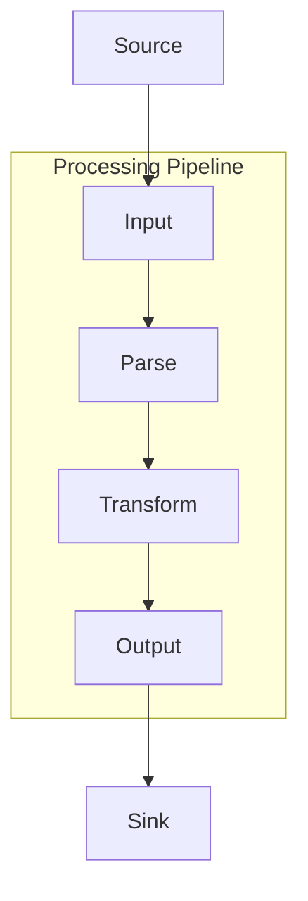

## Class styling

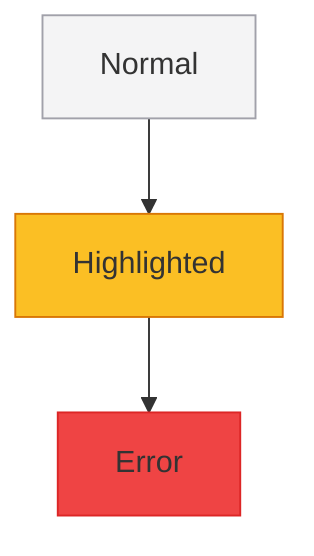

## Inline style overrides

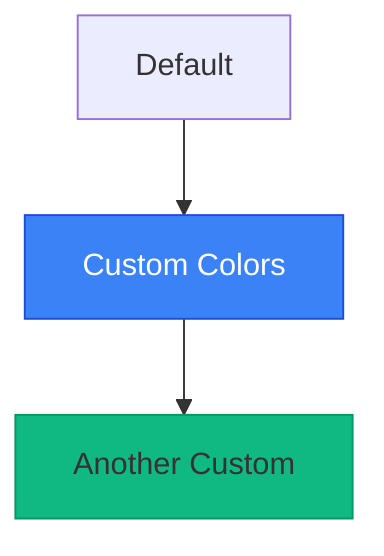

## CI/CD Pipeline

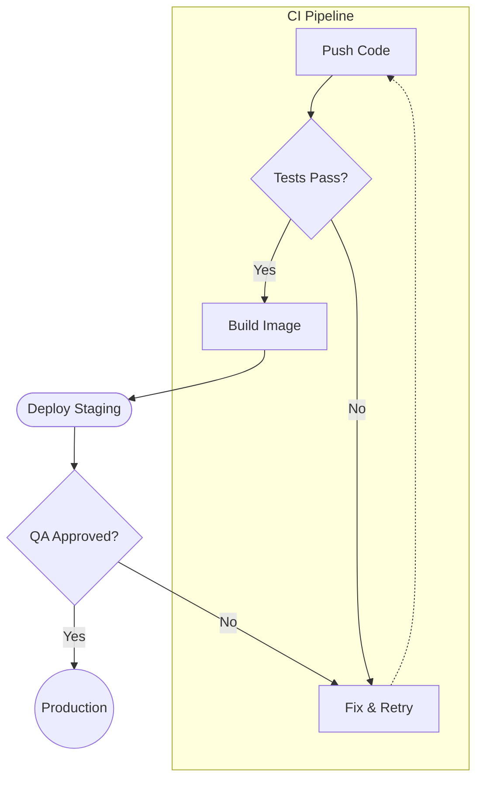

## System Architecture

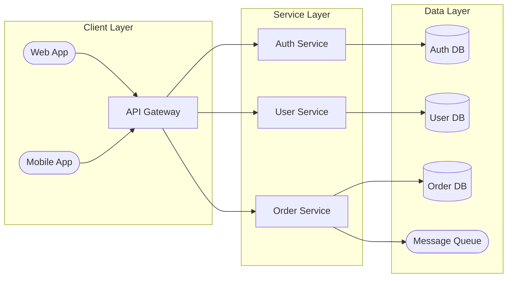

## Decision Tree

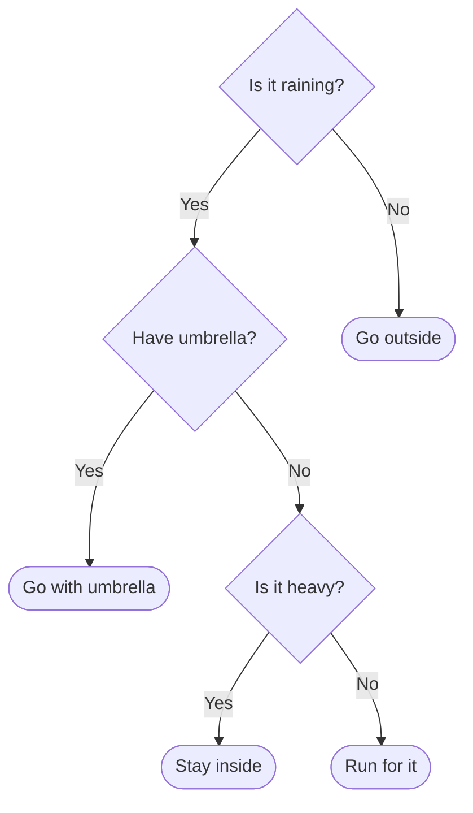

## Git Branching Workflow

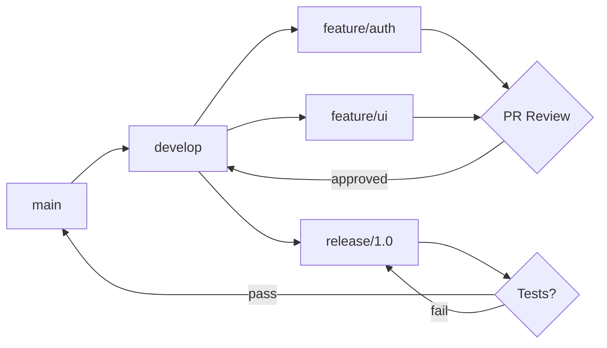
