# Sequence Diagram Examples

## Basic messages

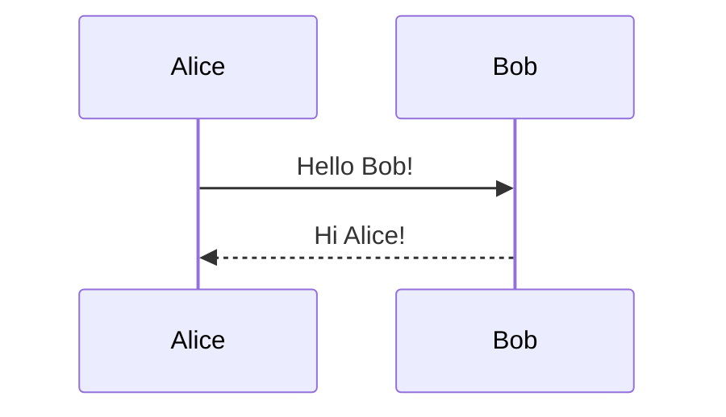

## Participant aliases

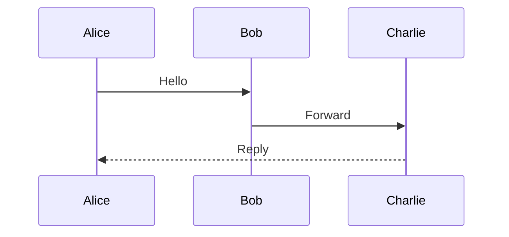

## Actor stick figures

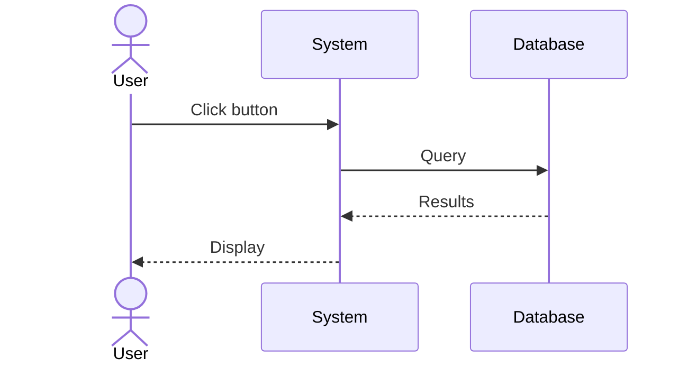

## Arrow types

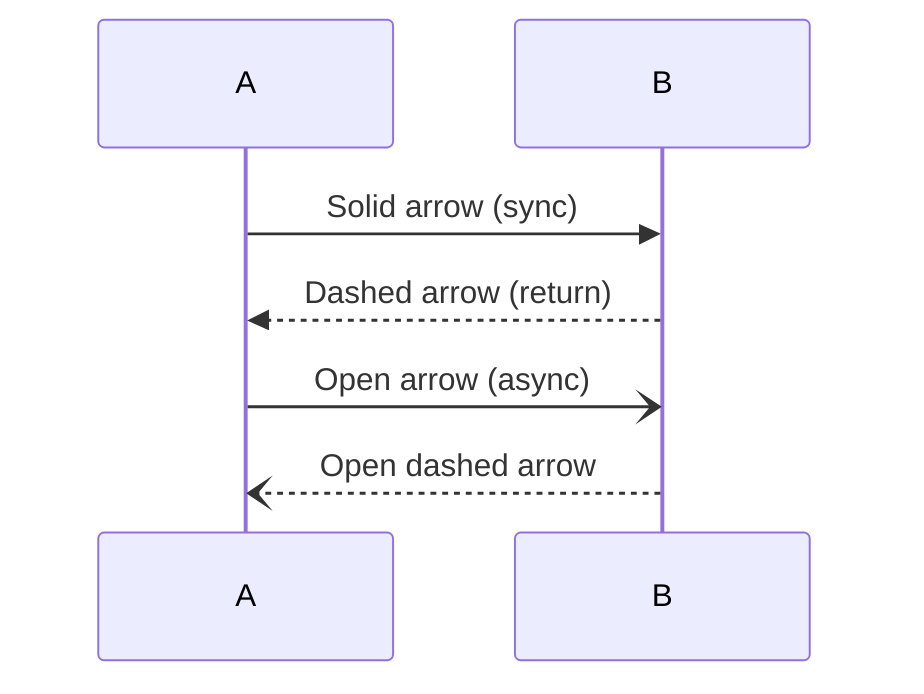

## Activation boxes

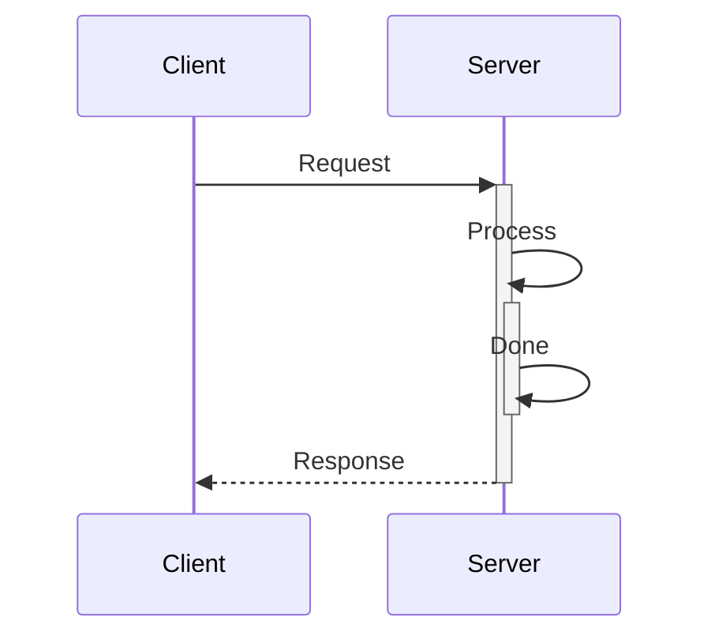

## Self-messages

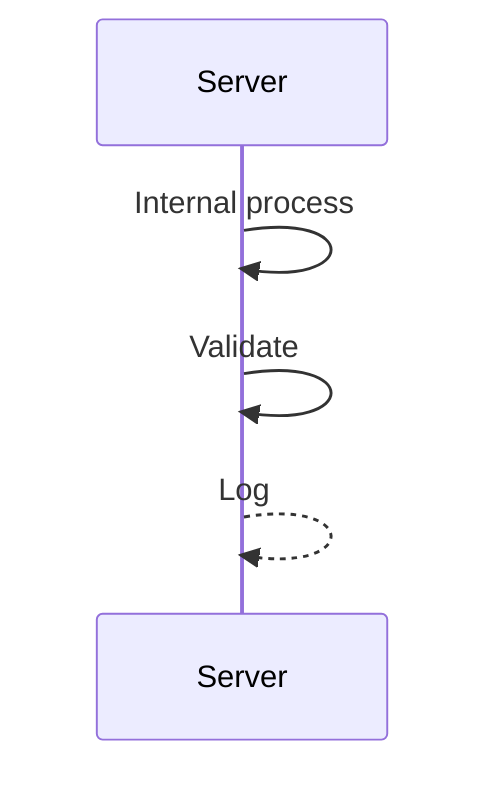

## Loop block

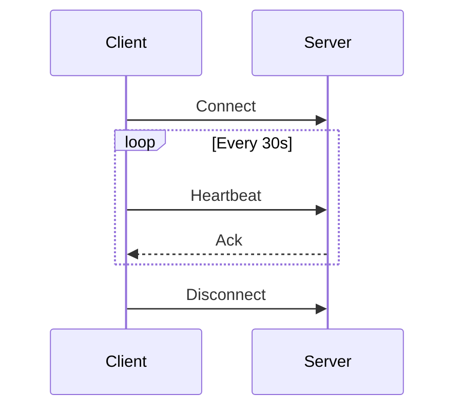

## Alt/else block

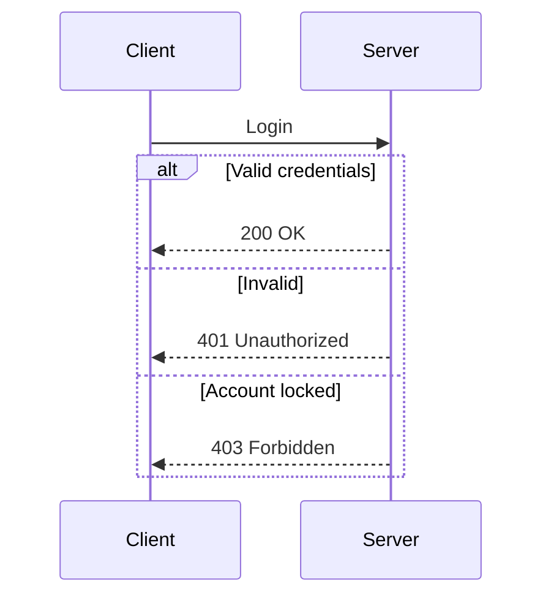

## Opt block

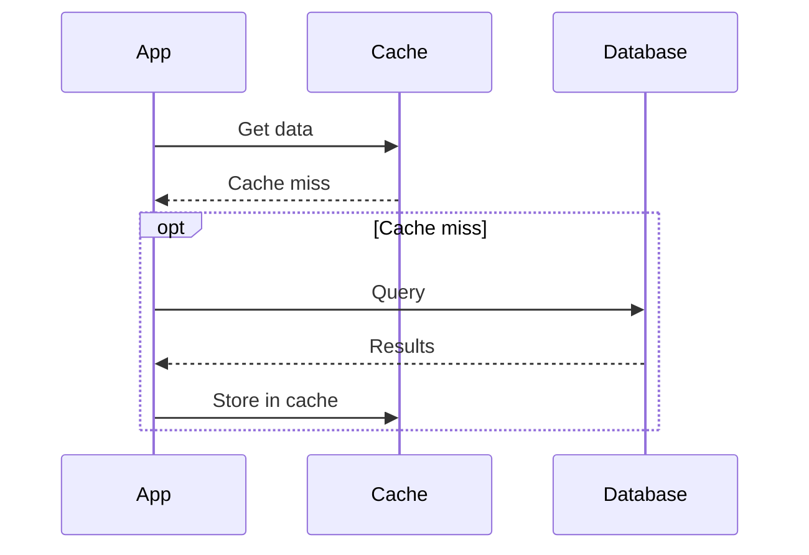

## Par block

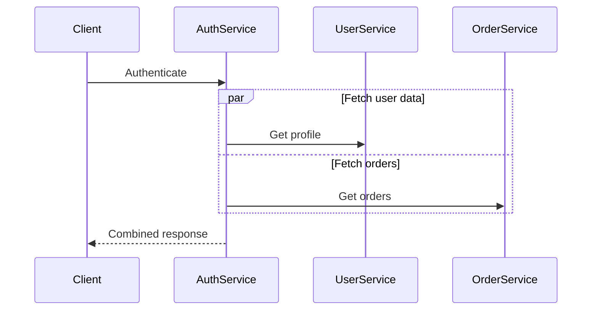

## Critical block

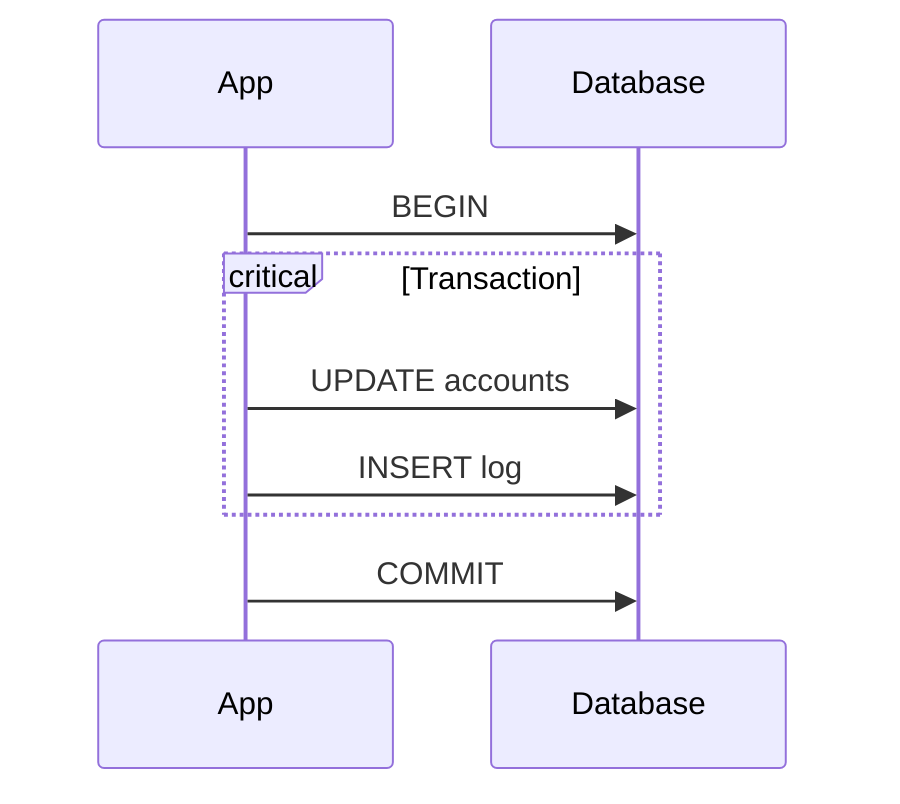

## Notes

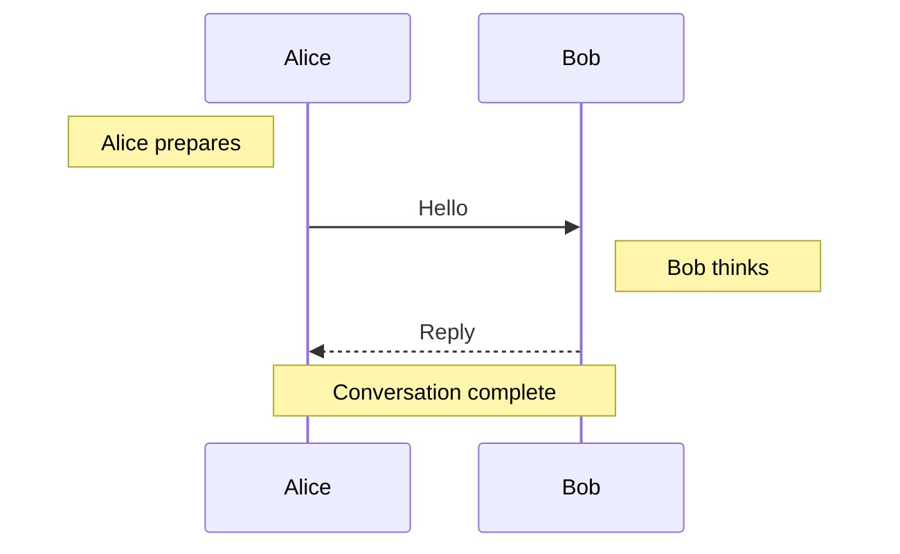

## OAuth 2.0 Flow

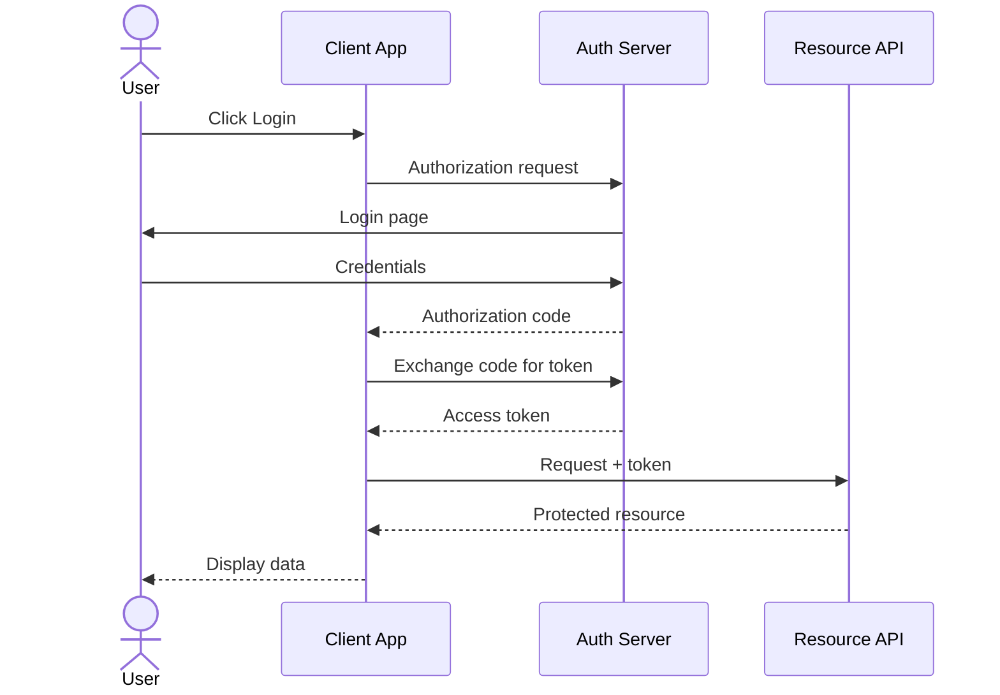

## Database Transaction

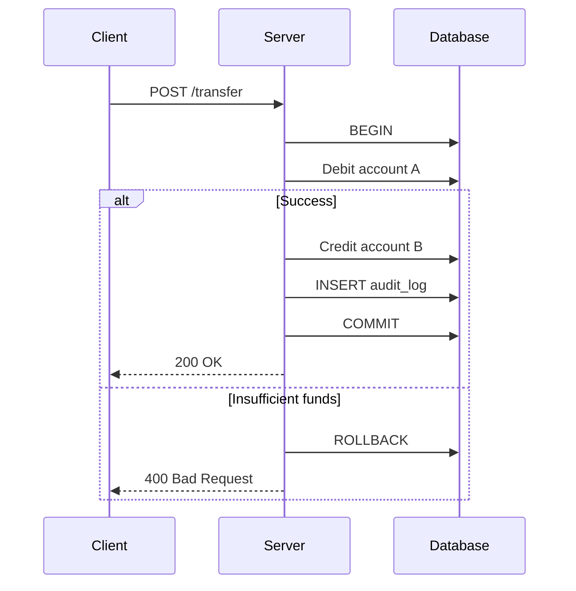

## Microservice Orchestration

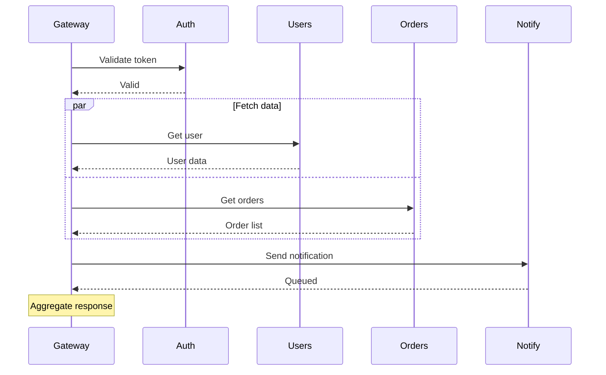
