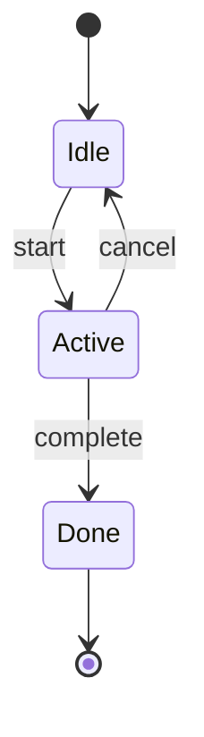
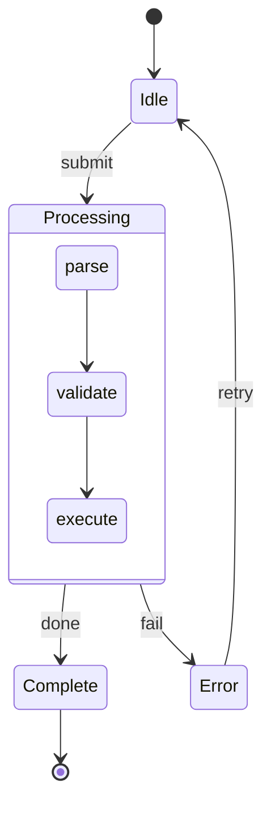
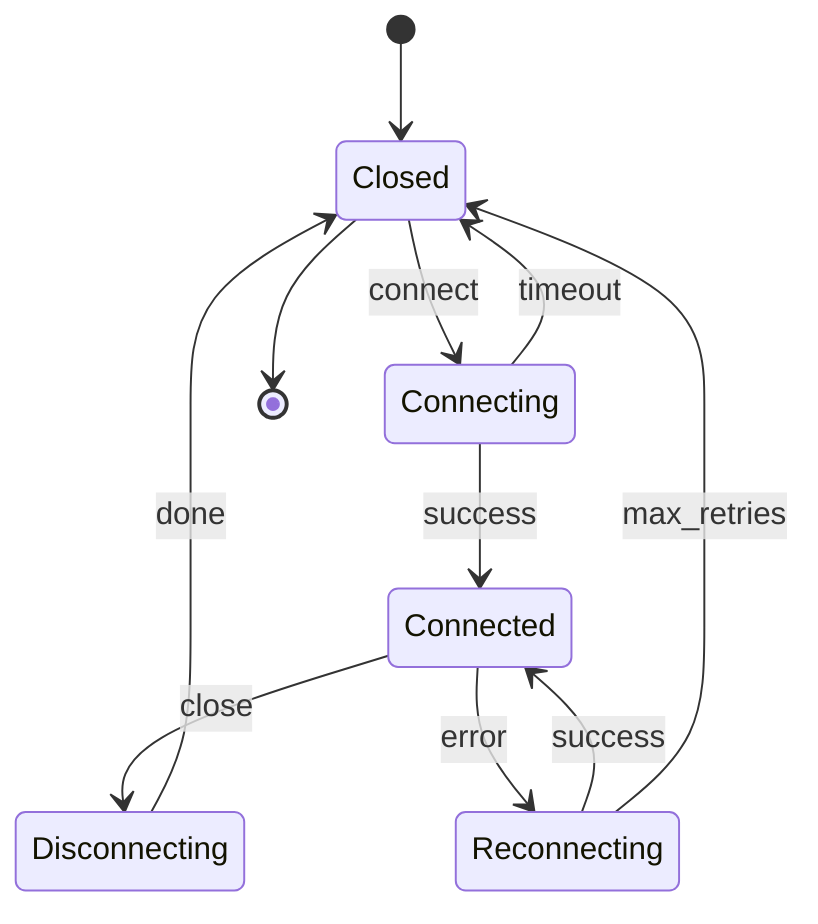

# State Diagram Examples

## Basic state diagram

```mermaid
stateDiagram-v2
  [*] --> Idle
  Idle --> Active : start
  Active --> Idle : cancel
  Active --> Done : complete
  Done --> [*]
```

## Composite states

```mermaid
stateDiagram-v2
  [*] --> Idle
  Idle --> Processing : submit
  state Processing {
    parse --> validate
    validate --> execute
  }
  Processing --> Complete : done
  Processing --> Error : fail
  Error --> Idle : retry
  Complete --> [*]
```

## Connection lifecycle (TCP-like)

```mermaid
stateDiagram-v2
  [*] --> Closed
  Closed --> Connecting : connect
  Connecting --> Connected : success
  Connecting --> Closed : timeout
  Connected --> Disconnecting : close
  Connected --> Reconnecting : error
  Reconnecting --> Connected : success
  Reconnecting --> Closed : max_retries
  Disconnecting --> Closed : done
  Closed --> [*]
```
