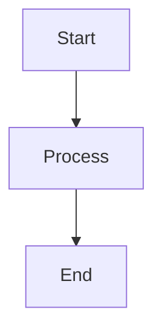

# Output Format

## Contents

- [Filename Convention](#filename-convention)
- [Frontmatter](#frontmatter)
- [Header Structure](#header-structure)
- [Linking Standards](#linking-standards)
- [Code Blocks](#code-blocks)
- [Callouts](#callouts)
- [Tables](#tables)

---

## Filename Convention

Use kebab-case for Obsidian compatibility:

```
# Good
react-state-management.md
golang-concurrency.md
system-design-interview.md

# Avoid
React State Management.md
golangConcurrency.md
System Design Interview.md
```

**Format**: `[topic]-MOC.md` or `[topic]-[scenario]-MOC.md`

Examples:
- `kubernetes.md`
- `kubernetes-learning.md`
- `react-interview-prep.md`

---

## Frontmatter

Add YAML frontmatter for Obsidian properties:

```yaml
---
title: [Title]
tags:
  - moc
  - [topic]
  - [scenario]
type: moc
created: [YYYY-MM-DD]
updated: [YYYY-MM-DD]
---

# [Title]

> [One-line description]

## 概述
```

**Minimal version** (if properties not needed):
```yaml
---
tags: moc, [topic]
---
```

---

## Header Structure

```
# H1: Main title (one per file)
## H2: Major sections
### H3: Sub-sections
#### H4: Details (use sparingly)
```

**Guidelines**:
- H1 only at top
- Max H4 depth
- At least one H2
- Logical hierarchy

---

## Linking Standards

### Wikilinks (Obsidian native)

```markdown
# Link to existing page
[[page-name]]

# Link with custom text
[[page-name|custom text]]

# Link to section
[[page-name#section-name]]

# Link to header in current file
[[#header-name]]
```

### External Links

```markdown
[link text](https://example.com)
[link text](https://example.com "optional title")
```

### Best Practices

- Prefer wikilinks for internal notes
- Use descriptive link text
- Avoid "click here" style

---

## Code Blocks

### Basic Syntax
```python
def example():
    pass
```

### With Filename
```python title="example.py"
def example():
    pass
```

### Line Numbers
```python linenums="1"
def example():
    pass
```

### Annotations
```python
def example():
    pass  # $1 important note
```

---

## Callouts

### Standard Callouts
```markdown
> [!info] 信息
> 这是信息内容

> [!warning] 警告
> 这是警告内容

> [!tip] 提示
> 这是提示内容

> [!danger] 危险
> 这是危险内容
```

### Collapsible
```markdown
> [!faq] 常见问题
> > **Q: 问题是什么？**
> > A: 答案在这里
```

### Custom Title
```markdown
> [!note] 自定义标题
> 内容
```

---

## Tables

### Basic Table
```markdown
| Column A | Column B | Column C |
| -------- | -------- | -------- |
| Value 1  | Value 2  | Value 3  |
| Value 4  | Value 5  | Value 6  |
```

### Aligned Columns
```markdown
| Left | Center | Right |
| :--- | :----: | ----: |
| A1   |   B1   |    C1 |
| A2   |   B2   |    C2 |
```

### Wide Table
```markdown
| Feature | Description | Status |
| ------- | ----------- | ------ |
|         |             |        |
^ Wide table header (for long tables)
```

---

## MOC Diagram Format

For architecture diagrams, use Mermaid:



**Placement**: Put after H2 section header

---

## Checklist Summary

Before final output:

- [ ] Filename is kebab-case
- [ ] Frontmatter is valid YAML
- [ ] H1 title matches filename
- [ ] All wikilinks use `[[ ]]`
- [ ] External links have https://
- [ ] Code blocks have language
- [ ] Tables are properly formatted
- [ ] Callouts use correct syntax
